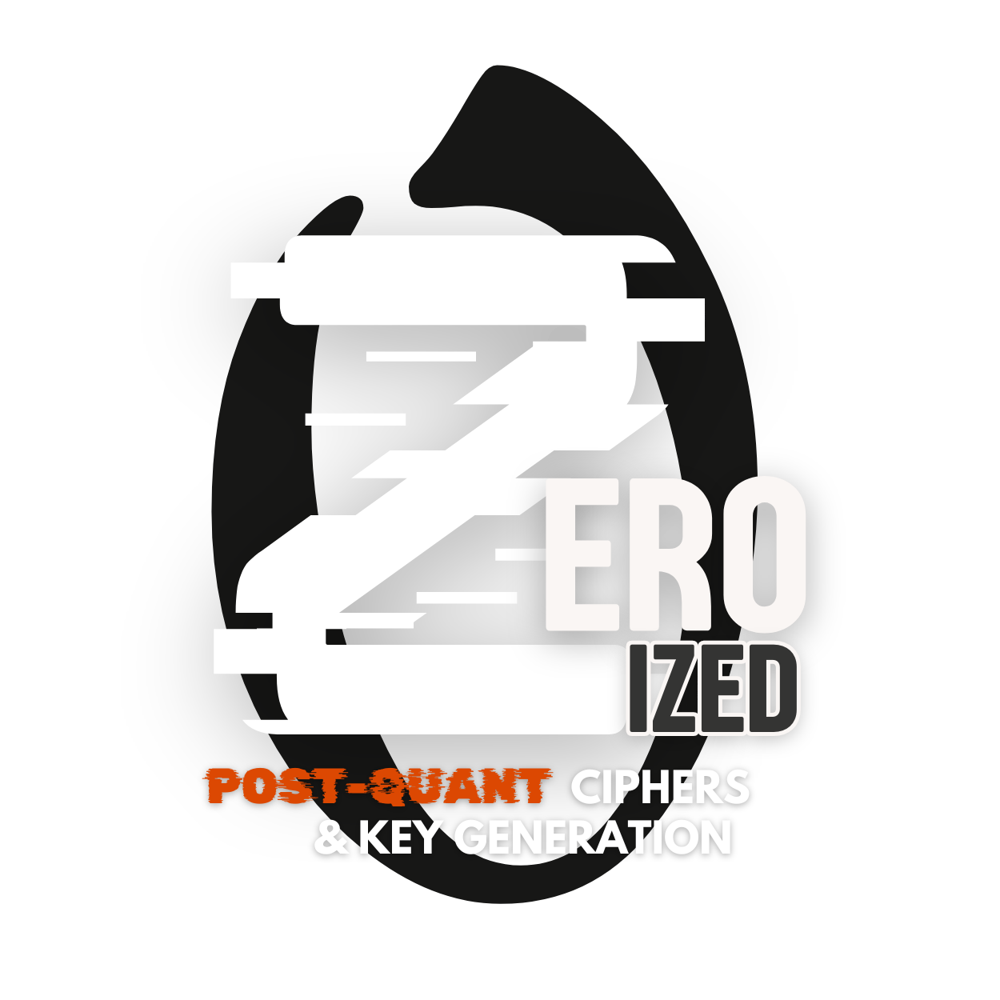

# Cryypt

<div align="center">
  
</div>

A comprehensive cryptography library for Rust, providing immutable builders for encryption, hashing, compression, and key management.

## Crates

This workspace contains the following crates:

### Core Cryptography

- **[cipher](./cipher/)** - Symmetric encryption algorithms (AES-GCM, ChaCha20-Poly1305)
- **[hashing](./hashing/)** - Cryptographic hash functions (SHA-256, SHA3, BLAKE2b)
- **[key](./key/)** - Key generation and management

### Data Processing

- **[compression](./compression/)** - Data compression algorithms (Zstandard, Gzip, Bzip2, ZIP)

### Advanced Features

- **[jwt](./jwt/)** - JSON Web Token creation and verification
- **[pqcrypto](./pqcrypto/)** - Post-quantum cryptography algorithms (Kyber, Dilithium, Falcon, SPHINCS+)
- **[quic](./quic/)** - QUIC transport protocol with built-in encryption
- **[vault](./vault/)** - Secure encrypted storage vault

### Main API

- **[cryypt](./cryypt/)** - Unified API with feature flags for selective functionality

### Supporting Crates

- **[common](./common/)** - Common infrastructure and error types
- **[map_macro](./map_macro/)** - Ergonomic map/set macros
- **[examples](./examples/)** - Example applications demonstrating usage

## Installation

Add the main crate with the features you need:

```toml
[dependencies]
# Core features
cryypt = { version = "0.1", features = ["aes", "sha256", "zstd", "key", "file-store"] }

# Or use feature groups
cryypt = { version = "0.1", features = ["encryption", "hashing", "compression"] }

# All features
cryypt = { version = "0.1", features = ["full"] }
```

Or use individual crates directly:

```toml
[dependencies]
cryypt_cipher = "0.1"
cryypt_hashing = "0.1"
cryypt_compression = "0.1"
cryypt_key = "0.1"
```

## API Design

Cryypt offers two equivalent APIs:

1. **Master Builder**: `Cryypt::cipher()`, `Cryypt::hash()`, `Cryypt::compress()`
2. **Direct Builders**: `Cipher::aes()`, `Hash::sha256()`, `Compress::zstd()`

Both are fully supported - use whichever feels more natural for your use case.

## Quick Examples

### Encryption

#### Single Result
```rust
use cryypt::Cryypt;

let encrypted = Cryypt::cipher()
    .aes()
    .with_key(key)
    .on_result(|result| {
        Ok(bytes) => bytes.into(),
        Err(e) => {
            log::error!("Encryption failed: {}", e);
            panic!("Critical encryption failure")
        }
    })
    .encrypt(b"Secret message")
    .await; // Returns fully unwrapped value - no Result wrapper
```

#### Streaming Chunks
```rust
use futures::StreamExt;

let mut stream = Cryypt::cipher()
    .aes()
    .with_key(key)
    .on_chunk(|result| {
        Ok(encrypted_chunk) => {
            // Process each encrypted chunk as it arrives
            send_to_network(&encrypted_chunk);
            encrypted_chunk.into()
        }
        Err(e) => {
            log::error!("Chunk encryption failed: {}", e);
            panic!("Critical chunk encryption failure")
        }
    })
    .encrypt(large_data);

while let Some(chunk) = stream.next().await {
    // Each chunk is already encrypted and ready to use
    process_encrypted_chunk(chunk);
}
```

### Hashing

#### Single Result
```rust
let hash = Cryypt::hash()
    .sha256()
    .on_result(|result| {
        Ok(bytes) => bytes.into(),
        Err(e) => {
            log::error!("Hash computation failed: {}", e);
            panic!("Critical hash failure")
        }
    })
    .compute(b"Hello, World!")
    .await; // Returns Vec<u8> - the actual hash bytes, fully unwrapped
```

#### Streaming Hash Computation
```rust
use futures::StreamExt;

let mut stream = Cryypt::hash()
    .blake3()
    .on_chunk(|result| {
        Ok(hash_chunk) => {
            // Process incremental hash state
            update_progress_bar();
            hash_chunk.into()
        }
        Err(e) => {
            log::error!("Hash chunk failed: {}", e);
            panic!("Critical hash chunk failure")
        }
    })
    .compute_stream(large_file_data);

while let Some(chunk) = stream.next().await {
    // Each chunk represents incremental hash progress
    log::info!("Hash progress: {} bytes processed", chunk.len());
}
```

### Compression

#### Single Result
```rust
let compressed = Cryypt::compress()
    .zstd()
    .with_level(3)
    .on_result(|result| {
        Ok(bytes) => bytes.into(),
        Err(e) => {
            log::error!("Compression failed: {}", e);
            panic!("Critical compression failure")
        }
    })
    .compress(b"Large text data...")
    .await; // Returns Vec<u8> - the compressed bytes, fully unwrapped
```

#### Streaming Compression
```rust
use futures::StreamExt;

let mut stream = Cryypt::compress()
    .zstd()
    .with_level(5)
    .on_chunk(|result| {
        Ok(compressed_chunk) => {
            // Stream compressed chunks to storage
            write_to_archive(&compressed_chunk);
            compressed_chunk.into()
        }
        Err(e) => {
            log::error!("Compression chunk failed: {}", e);
            panic!("Critical compression chunk failure")
        }
    })
    .compress(massive_dataset);

while let Some(chunk) = stream.next().await {
    // Each chunk is compressed and ready for storage
    total_compressed_size += chunk.len();
}
```

### Key Management

#### Single Key Generation
```rust
let key = Cryypt::key()
    .aes()
    .with_size(256)
    .on_result(|result| {
        Ok(key_bytes) => key_bytes.into(),
        Err(e) => {
            log::error!("Key generation failed: {}", e);
            panic!("Critical key generation failure")
        }
    })
    .generate()
    .await;
```

#### Batch Key Generation
```rust
use futures::StreamExt;

let mut stream = Cryypt::key()
    .rsa()
    .with_size(4096)
    .on_chunk(|result| {
        Ok(keypair_chunk) => {
            // Store each generated keypair
            store_keypair_securely(&keypair_chunk);
            keypair_chunk.into()
        }
        Err(e) => {
            log::error!("Keypair generation failed: {}", e);
            panic!("Critical keypair generation failure")
        }
    })
    .generate_batch(100); // Generate 100 keypairs

while let Some(keypair) = stream.next().await {
    log::info!("Generated keypair {}", keypair.len());
}
```

### JWT (JSON Web Tokens)

#### Single JWT
```rust
let jwt = Cryypt::jwt()
    .hs256()
    .with_secret(secret_key)
    .with_claims(Claims::new()
        .subject("user123")
        .expiration(Utc::now() + Duration::hours(1))
    )
    .on_result(|result| {
        Ok(jwt_bytes) => {
            let token = String::from_utf8(jwt_bytes.clone()).unwrap();
            log::info!("JWT: {}", token);
            jwt_bytes.into()
        }
        Err(e) => {
            log::error!("JWT signing failed: {}", e);
            panic!("Critical JWT signing failure")
        }
    })
    .sign()
    .await;
```

#### Batch JWT Signing
```rust
use futures::StreamExt;

let mut stream = Cryypt::jwt()
    .rs256()
    .with_private_key(private_key)
    .on_chunk(|result| {
        Ok(jwt_chunk) => {
            // Process batch of signed JWTs
            distribute_tokens(&jwt_chunk);
            jwt_chunk.into()
        }
        Err(e) => {
            log::error!("JWT batch signing failed: {}", e);
            panic!("Critical JWT batch failure")
        }
    })
    .sign_batch(user_claims_list);

while let Some(jwt_batch) = stream.next().await {
    log::info!("Signed {} JWTs", jwt_batch.len());
}
```

### Post-Quantum Cryptography

#### Single Keypair
```rust
let keypair = Cryypt::pqcrypto()
    .kyber()
    .with_security_level(SecurityLevel::Level3)
    .on_result(|result| {
        Ok(keypair_bytes) => keypair_bytes.into(),
        Err(e) => {
            log::error!("PQ keypair generation failed: {}", e);
            panic!("Critical PQ keypair failure")
        }
    })
    .generate_keypair()
    .await;
```

#### Batch PQ Operations
```rust
use futures::StreamExt;

let mut stream = Cryypt::pqcrypto()
    .dilithium()
    .with_security_level(SecurityLevel::Level5)
    .on_chunk(|result| {
        Ok(signature_chunk) => {
            // Process batch of PQ signatures
            verify_signatures(&signature_chunk);
            signature_chunk.into()
        }
        Err(e) => {
            log::error!("PQ signature batch failed: {}", e);
            panic!("Critical PQ signature failure")
        }
    })
    .sign_batch(messages);

while let Some(signatures) = stream.next().await {
    log::info!("Generated {} PQ signatures", signatures.len());
}
```

### QUIC Transport

#### Single Connection
```rust
let connection = Cryypt::quic()
    .http3()
    .with_endpoint("https://example.com:443")
    .with_certificates(cert_data)
    .on_result(|result| {
        Ok(connection_data) => {
            log::info!("QUIC connection established");
            connection_data.into()
        }
        Err(e) => {
            log::error!("QUIC connection failed: {}", e);
            panic!("Critical QUIC connection failure")
        }
    })
    .connect()
    .await;
```

#### Streaming Data over QUIC
```rust
use futures::StreamExt;

let mut stream = Cryypt::quic()
    .http3()
    .with_connection(connection)
    .on_chunk(|result| {
        Ok(data_chunk) => {
            // Process streamed data chunks
            process_realtime_data(&data_chunk);
            data_chunk.into()
        }
        Err(e) => {
            log::error!("QUIC stream failed: {}", e);
            panic!("Critical QUIC stream failure")
        }
    })
    .send_stream(large_payload);

while let Some(chunk) = stream.next().await {
    log::info!("Received {} bytes over QUIC", chunk.len());
}
```

### Vault Storage

#### Single Storage Operation
```rust
let storage_result = Cryypt::vault()
    .surrealdb()
    .with_encryption(EncryptionConfig::aes256())
    .with_cache(CacheConfig::memory(1000))
    .on_result(|result| {
        Ok(storage_data) => {
            log::info!("Item stored successfully");
            storage_data.into()
        }
        Err(e) => {
            log::error!("Vault storage failed: {}", e);
            panic!("Critical vault storage failure")
        }
    })
    .store("user:123", user_data)
    .await;
```

#### Bulk Storage Operations
```rust
use futures::StreamExt;

let mut stream = Cryypt::vault()
    .surrealdb()
    .with_encryption(EncryptionConfig::chacha20())
    .on_chunk(|result| {
        Ok(storage_chunk) => {
            // Process bulk storage results
            update_storage_metrics(&storage_chunk);
            storage_chunk.into()
        }
        Err(e) => {
            log::error!("Bulk storage failed: {}", e);
            panic!("Critical bulk storage failure")
        }
    })
    .store_bulk(large_dataset);

while let Some(chunk) = stream.next().await {
    log::info!("Stored {} items", chunk.len());
}
```

## License

Licensed under either of:

- Apache License, Version 2.0 ([LICENSE-APACHE](LICENSE-APACHE) or <http://www.apache.org/licenses/LICENSE-2.0>)
- MIT license ([LICENSE-MIT](LICENSE-MIT) or <http://opensource.org/licenses/MIT>)

at your option.

## Contribution

Unless you explicitly state otherwise, any contribution intentionally submitted for inclusion in the work by you, as defined in the Apache-2.0 license, shall be dual licensed as above, without any additional terms or conditions.
